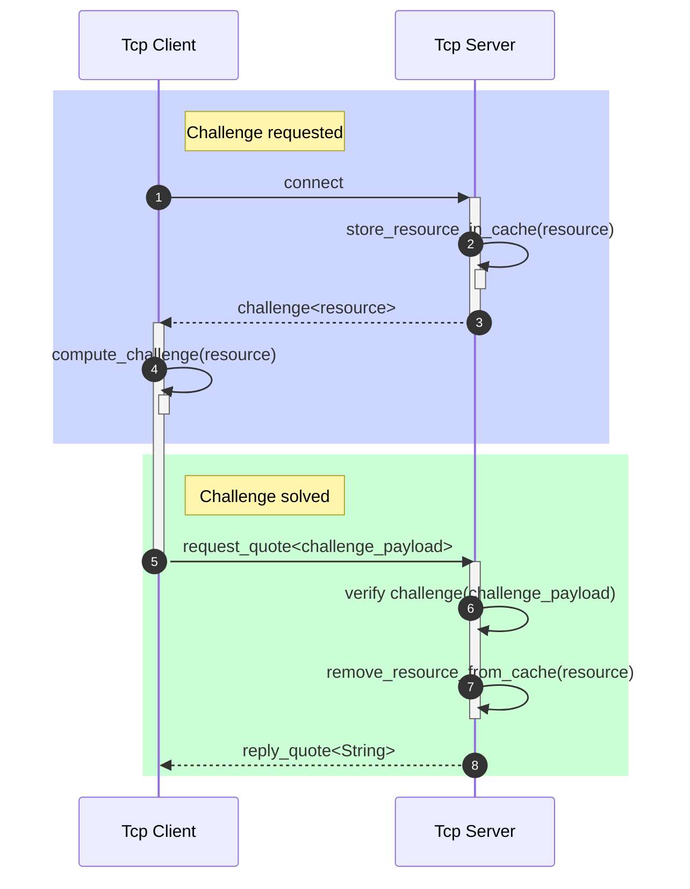

# Word of Wisdom solution

## Requirements

Design and implement “Word of Wisdom” TCP server.

- TCP server should be protected from DDOS attacks with the [Proof of Work](https://en.wikipedia.org/wiki/Proof_of_work), the challenge-response protocol should be used.
- The choice of the POW algorithm should be explained.
- After Proof Of Work verification, server should send one of the quotes from “word of wisdom” book or any other collection of the quotes.
- Docker file should be provided both for the server and for the client that solves the POW challenge.

## Overview

### Description

- The communication protocol is minimalistic by design. We don't want to uncover things to abuser.
-There are a lot of options regarding protection of using the same PoW token. This solution is required to use a client ip as a resource part.
- The server stores challenge resources in a cache, deleting them when a PoW token with the resource is received. It is a tradeoff that keeps us from using a cryptography, or storing a huge amount of received early tokens.

### Limitations

- In case of server restarts, all challenges that were received by clients become invalid.
- PoW tokens cache is located in memory, so the server can't scale horizontally (see [Further Improvements](#further-improvements) section below).

#### How it works



### PoW algorithm selection benefits

The [hashcash](http://www.hashcash.org/) algorithm has been selected because of following reasons:

- Widely Accepted: Hashcash is a well-known and widely adopted proof-of-work protocol. It has been used in various applications, including email systems, to combat spam.
- Computational Resource Intensive: The computational nature of Hashcash puzzles makes it an effective deterrent against DDoS attacks. Solving the puzzle requires significant computational resources, which becomes challenging for attackers attempting to launch large-scale DDoS attacks.
- Adjustable Difficulty: Hashcash allows you to adjust the difficulty level of the proof-of-work puzzle.
- Minimal Client Impact: Hashcash imposes a computational burden on the client by requiring them to solve the proof-of-work puzzle.

### Further improvements

This code is provided as a PoC and it could be improved. For instance:

- use the same code style because of currently, a slighlty different ones are used by design.
- store PoW tokens cache in Redis or another persistent storage with auto remove according TTL feature turned on.
- handle errors better (consider transfer some details to a client)
- additinal tests.

## Usage

### Environment variables

- `PORT`: used both by client and server

### Run locally

> 📝 _Make sure rust and cargo both are installed._

First, run the server instance:

```console
cargo run -p word-of-wisdom-server
```

and after is started, run the client within a different terminal:

```console
cargo run -p word-of-wisdom-client
```

### Deploy

> 📝 _To detach out of a container push ^P^Q key sequence._

For running inside docker containers, type:

```console
docker network create word-of-wisdom-network
docker build -t word-of-wisdom .

docker run --network word-of-wisdom-network --name word-of-wisdom-server -it -p 44000:44000 -e SERVICE=server word-of-wisdom

docker run --network word-of-wisdom-network -e SERVICE=client -e SERVER_HOST=word-of-wisdom-server word-of-wisdom
```
